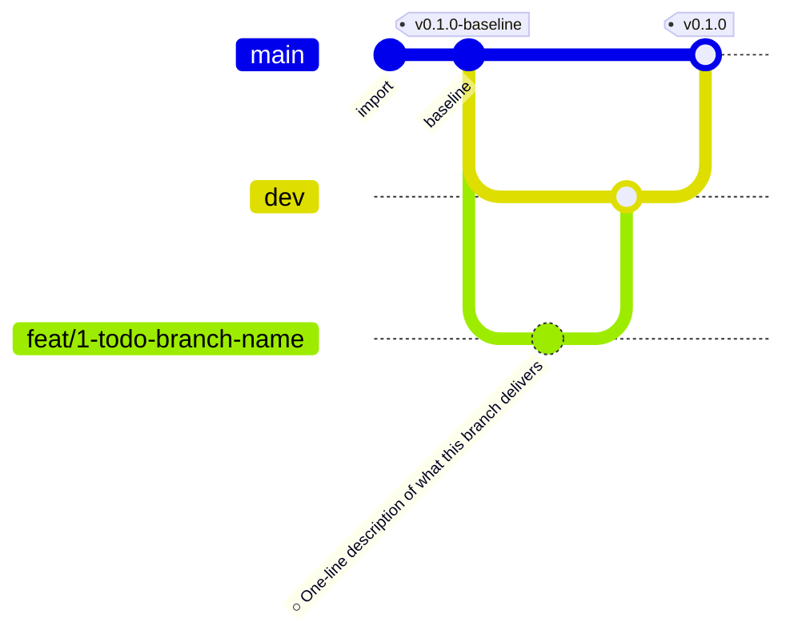

<!--
  Auto-generated from .github/roadmap.yaml by
  .github/scripts/render_roadmap.py. Do not edit this file directly —
  changes will be overwritten on the next run of the `Render ROADMAP`
  workflow. Edit the YAML or close / reopen a tracking issue instead.
-->

# Project roadmap

Phased delivery plan for this repository. Each phase is a cluster of feat branches cut from `dev`; a milestone tag on `main` closes the phase once every branch in it has merged. Branch status badges (✅ / 🔄 / 🔜) are derived from each branch's tracking issue state in GitHub Issues.

## Phase summary

| Phase | Title | Branches | Milestone tag |
|:---:|---|---|---|
| 1 | TODO — first phase title | 🔜 planned `feat/1-todo-branch-name` | `v0.1.0` |

## Branch diagram

---

## How this file is maintained

- **Source of truth**: [`.github/roadmap.yaml`](.github/roadmap.yaml)
- **Renderer**: [`.github/scripts/render_roadmap.py`](.github/scripts/render_roadmap.py)
- **Workflow**: [`.github/workflows/roadmap.yml`](.github/workflows/roadmap.yml)

The workflow runs on every push to `dev`. If any branch status changed
(a tracking issue was closed, the YAML was edited, a new branch was
added) it regenerates this file and auto-commits with the message
`chore: regenerate ROADMAP.md [skip ci]`.
